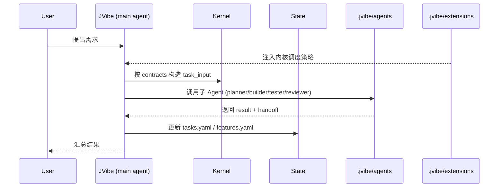

# JVibe 系统架构

> 描述 JVibe 的整体架构、模块分层和数据流。

---

## 1. 项目定位

JVibe 是一个个人专属 Agent 运行时。它内化 coding-agent 的底层能力、个人工作流、文档状态、Agent 协作和扩展机制，形成一个新的 Agent。

核心关注四件事：

- **内核**：Agent 契约与调度策略（`kernel/`）
- **运行时**：JVibe 行为注入（`.jvibe/`）
- **状态与配置**：任务交接、功能追踪、插件注册（`state/`、`config/`）
- **文档与技能**：人读架构说明、可扩展工作流模块（`docs/`、`skills/`）
- **交互表面**：TUI Mode 与 Visual Mode 共享同一内核（见 `docs/interface-modes.md`）

---

## 2. 分层架构

```
┌─────────────────────────────────────────┐
│               skills/                    │  可扩展技能
├─────────────────────────────────────────┤
│               docs/                      │  人读文档
├─────────────────────────────────────────┤
│         state/ + config/                │  运行时状态 + 配置
├─────────────────────────────────────────┤
│              .jvibe/                        │  JVibe 运行时绑定
│  ┌──────────────────────────────────┐   │
│  │  agents/  extensions/  prompts/  │   │
│  └──────────────────────────────────┘   │
├─────────────────────────────────────────┤
│       TUI Mode + Visual Mode             │  两种交互表面
├─────────────────────────────────────────┤
│              kernel/                     │  内核
│  ┌──────────────────────────────────┐   │
│  │  contracts.yaml  orchestration   │   │
│  └──────────────────────────────────┘   │
└─────────────────────────────────────────┘
```

**依赖方向**：上层依赖下层。`kernel/` 在最底层，不依赖任何上层。`skills/` 在最顶层，可以依赖所有下层。

---

## 3. 模块交互



---

## 4. 文件形态

| 分类 | 技术/形态 | 位置 |
|------|-----------|------|
| 内核契约 | YAML | `kernel/contracts.yaml` |
| 调度策略 | Markdown | `kernel/orchestration.md` |
| 运行时绑定 | TypeScript / Markdown | `.jvibe/` |
| 运行时状态 | YAML | `state/` |
| 配置 | YAML | `config/` |
| 交互模式声明 | YAML / Markdown | `config/modes.yaml`、`docs/interface-modes.md` |
| 文档 | Markdown | `docs/` |
| 技能 | Markdown (SKILL.md) | `skills/` |
| 过渡资产 | Shell / Markdown / TOML | `legacy/` |

---

## 5. 环境配置

| 项目项 | 值 |
|--------|-----|
| 项目根路径 | `/Users/jenkinschen5/Desktop/ManyThings/LLM/JVibe` |
| 内核路径 | `kernel/` |
| 运行时路径 | `.jvibe/` |
| 状态路径 | `state/` |
| 配置路径 | `config/` |
| 文档路径 | `docs/` |
| 上游参考 | coding-agent runtime |
| Visual Mode 参考 | `craft-ai-agents/craft-agents-oss` |
