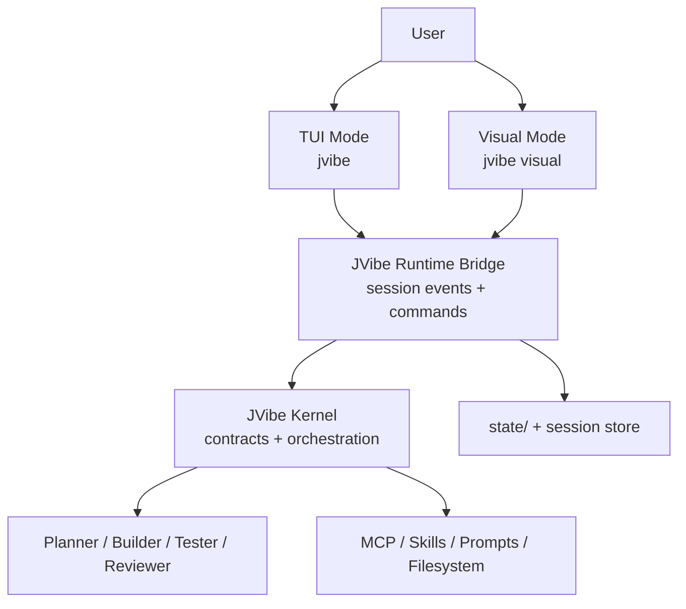

# JVibe Interface Modes

> 定义 JVibe 的两种使用形态：TUI Mode 和 Visual Mode。两者不是两个 Agent，而是同一个 JVibe kernel 的两种交互表面。

---

## 1. 核心判断

JVibe 应该有两个版本：

| Mode | 定位 | 当前状态 |
|------|------|----------|
| TUI Mode | 终端优先、低摩擦、适合 coding 用户的日常主入口 | 开发中 |
| Visual Mode | 可视化工作台，适合多会话、Artifact、Sources、Diff、Review | 规划中 |

两种模式共享同一个内核：

- `kernel/contracts.yaml`：Planner / Builder / Tester / Reviewer 的协作契约。
- `kernel/orchestration.md`：默认调度策略。
- `.jvibe/`：运行时资源、prompt、subagent、extension。
- `.mcp.json`：MCP sources。
- `state/`：任务、功能、历史工作状态。

差异只应该发生在 UI、交互密度、会话呈现和 Artifact 呈现上。

---

## 2. TUI Mode

TUI Mode 是默认入口：

```bash
jvibe
```

设计方向：

- 保持 terminal-native，不做“大屏监控台”。
- 顶部只显示必要状态：项目、分支、模型、上下文、工具状态。
- 主区域是 conversation / work log，不常驻复杂边栏。
- Planner / Builder / Tester / Reviewer 是内核机制，不作为用户必须手动操作的 UI 面板。
- 适合快速 coding、shell-heavy 工作、短计划、快速验证。

当前实现：

- `.jvibe/extensions/jvibe-kernel.ts` 提供轻量 TUI header。
- `.jvibe/settings.json` 使用 `quietStartup` 减少启动噪声。

---

## 3. Visual Mode

Visual Mode 是第二入口，目标命令：

```bash
jvibe visual
```

它吸收 `craft-agents-oss` 的产品形态，但不直接复制 Craft 的业务边界。值得吸收的部分：

| Craft 机制 | JVibe Visual Mode 用法 |
|------------|-------------------------|
| Multi-session inbox | 展示多个 JVibe session、状态、重要标记 |
| Session workflow status | 映射为 Todo / In Progress / Needs Review / Done |
| Sources | 管理 MCP、REST API、filesystem、skills |
| Permission modes | 映射为 Explore / Ask to Edit / Auto |
| Rich tool visualization | 将 tool call、shell、MCP、subagent 输出可视化 |
| Multi-file diff | 为 Builder/Reviewer 提供改动审查视图 |
| Background tasks | 呈现长任务、subagent、automation 的进度 |
| Theme/workspace model | 提供个人工作区级别的 UI 配置 |

不吸收的部分：

- 不把 JVibe 变成 Craft 文档客户端。
- 不把 Visual Mode 做成另一个完整 runtime。
- 不让 UI 状态反过来主导 Agent 契约。
- 不把所有 source/API 配置隐藏成不可追踪的魔法。

---

## 4. 建议架构



关键点：

1. TUI 和 Visual 都不直接拥有 Agent 规则，只调用 runtime bridge。
2. Bridge 输出统一 session event stream，用于 TUI 文本渲染和 Visual 卡片渲染。
3. Visual Mode 可以先做 Web UI，再决定是否包成 Electron / Tauri 桌面端。
4. Artifact、Diff、Tool call、Subagent run 都应该有统一事件 schema。

---

## 5. 演进路线

### v0.1：TUI 收敛

- `jvibe` 默认启动 TUI。
- TUI header 简洁化。
- 内核角色编排默认注入。

### v0.2：Runtime Bridge

- 定义 JVibe session event schema。
- 抽象 `send_message`、`cancel`、`list_sessions`、`read_session`、`switch_mode`。
- TUI 和 Visual 共用这层接口。

### v0.3：Visual Web Prototype

- 新增 `apps/visual/`，使用 React + Vite。
- 先实现 workspace/session list、chat stream、permission mode、source list。
- Diff、artifact preview 和 background task 作为第二批。

### v0.4：Desktop Shell

- 根据实际使用决定 Electron、Tauri 或纯 Web。
- 若选择 Electron，可参考 Craft 的 thin-client/headless server 形态。

---

## 6. 验收标准

Visual Mode 第一版不追求完整替代 TUI，只需满足：

1. 能列出当前 workspace 和 sessions。
2. 能打开一个 session，展示 user / assistant / tool / subagent events。
3. 能发送消息，并复用 JVibe kernel orchestration。
4. 能展示 permission mode 和 MCP/source 状态。
5. 能打开 diff/artifact preview 的最小版本。
6. 不复制 Craft 依赖链，除非确认该依赖服务于 JVibe 的核心体验。
